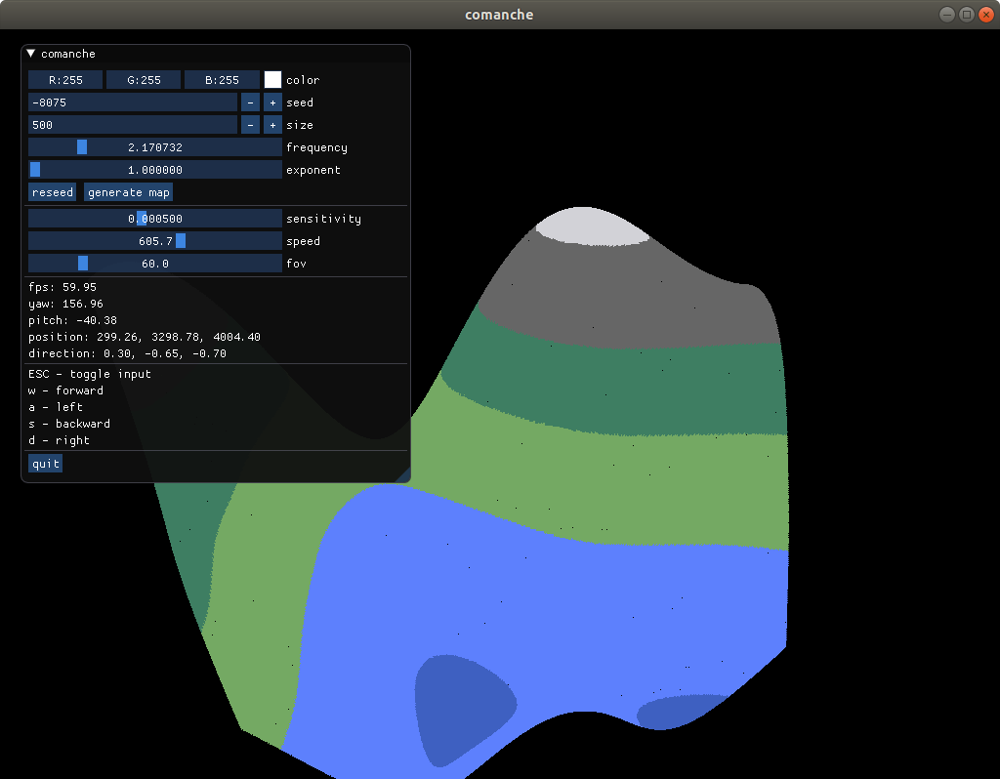

# comanche

## install

Ubuntu 17.04

    sudo apt install cmake make g++ libx11-dev libxi-dev libgl1-mesa-dev libglu1-mesa-dev libxrandr-dev libxext-dev libxi-dev xorg-dev
    cd comanche
    git submodule update --init --recursive
    mkdir build
    cd build
    cmake ..
    make all
    ./comanche

## license
GPL v3

## copyright
Copyright (C) 2018 Aaron Lebo

